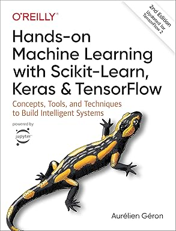

# Hands-on-Machine-Learning

  
  

    

      This repository contains my personal study notes and code exercises as I work through the second edition of <em>"Hands-On Machine Learning with Scikit-Learn, Keras, and TensorFlow"</em> by Aurélien Géron.
    

  

# My Roadmap
1) [The Machine Learning Landscape](https://github.com/RafaelaAbrahao/Hands-on-Machine-Learning/blob/main/01-Machine-Learning-Landscape.ipynb)
2) [End-to-End Machine Learning Project](https://github.com/RafaelaAbrahao/Hands-on-Machine-Learning/blob/main/02-End-to-End-Machine-Learning-Project.ipynb)